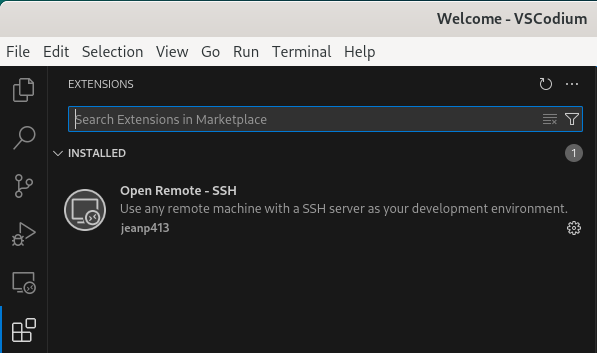
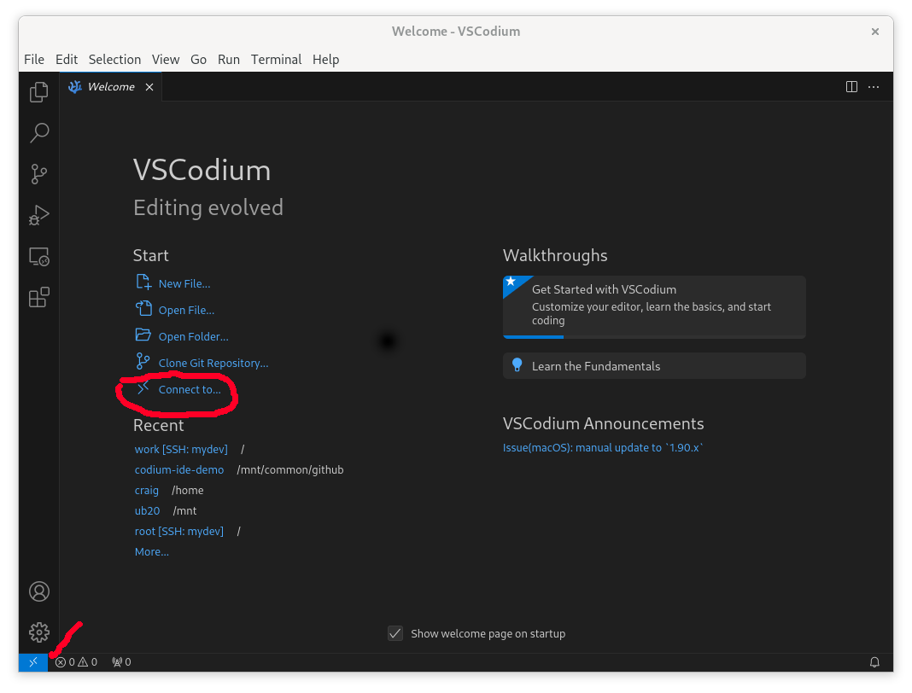
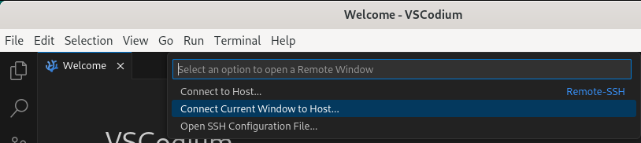
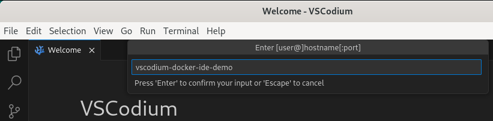
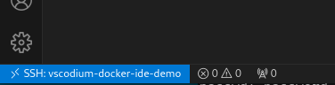
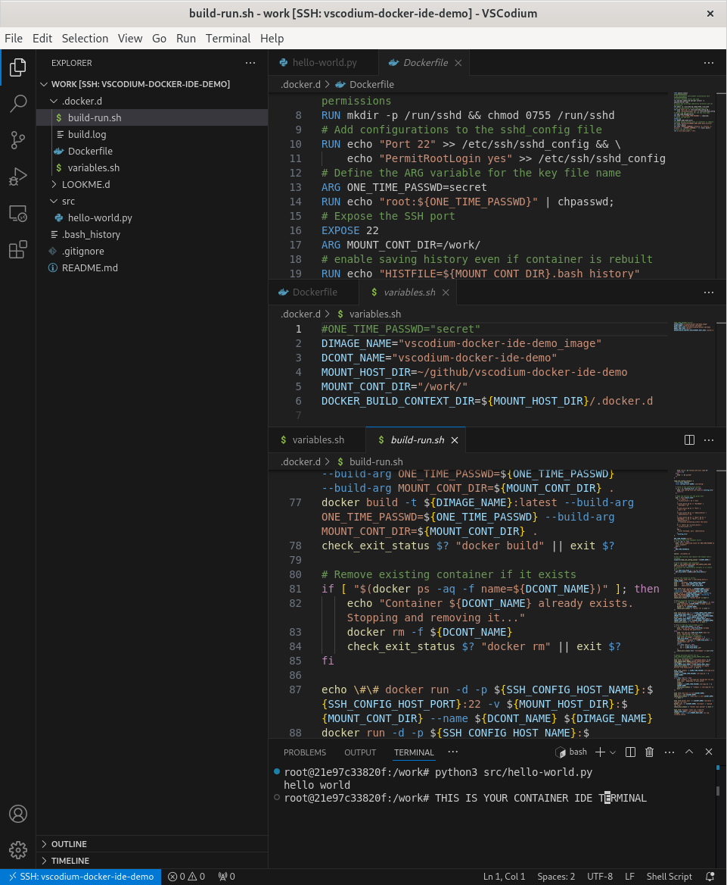
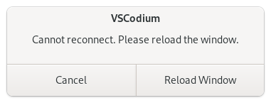
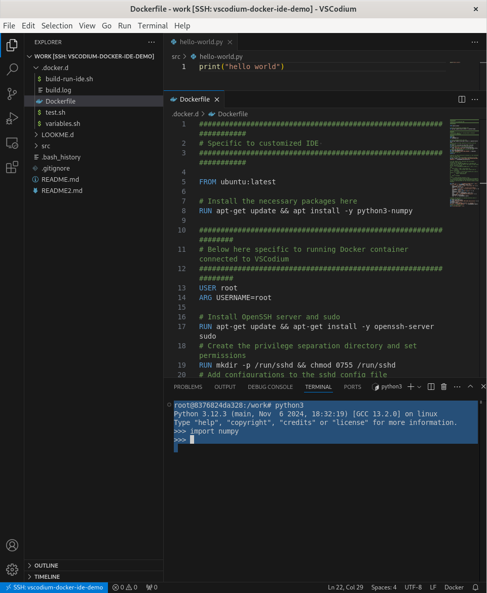

VSCodium / SSH / Docker Container IDE Demo
------------------------------------------

<!-- image goes here -->

## 1. Overview

*vscodium-docker-ide-demo* is a demonstration of how to use VSCodium to connect via SSH to a Docker container, enabling an integrated development environment (IDE). It parallels the behavior of running VSCode with the Microsoft Devcontainer extension.

The following third-party open-source software components are used:
- Docker containers
- OpenSSH
- VSCodium (a free, open-source version of Visual Studio Code)
- "Open Remote" [by jeanp413], an extension for VSCodium

In addition, *vscodium-docker-ide-demo* provides:
- A template Dockerfile [`.docker.d/Dockerfile`] containing modifications to allow SSH access by making the container an SSH server, and other necessary customizations needed to allow integrated development with VSCodium.
   - The end user would typically modify this Dockerfile by inserting calls to install their desired software packages.
- A bash script [`.docker.d/build-run-ide.sh`] to build the Docker container, and start running it with SSHD running.
   - This bash script is reusable between user projects without modification.
- A bash file for variables [`.docker.d/variables.sh`].
   - This bash file contains the project-dependent settings and is read by the `build-run-ide.sh` script. Some of the variables are passed to the Dockerfile as build arguments.
   - Other variables will be added per project in your `.ssh/config` file.

### 1.1 Limitations

Currently, *vscodium-docker-ide-demo* has only been developed and tested 
   - on Linux Debian12 (Bookworm)
   - with VSCodium installed via Flatpak
   - with the Docker container running on the same machine as VSCodium, with a mounted volume
   - with the container user running as root

Running VSCodium and the container on the same machine allows volume mounting. In that case, the container user running as root is a simple way to avoid file permission issues, i.e., reading and writing from both host and container sides. If the container were run on a remote machine, i.e., in the cloud, then a mounted volume wouldn't be used, and the container user should be a non-root user.

## 2. Instructions

### 2.1 Installation of Third-Party Software on the Host Machine

#### 2.1.1 Docker 

```bash
sudo apt install docker-compose
```

#### 2.1.2 Flatpak

```bash
sudo apt install flatpak
```

If using the GNOME Desktop GUI, add Flatpak to the application tray with:

```bash
sudo apt install gnome-software-plugin-flatpak
```

Configuration:

```bash
flatpak remote-add --if-not-exists flathub https://dl.flathub.org/repo/flathub.flatpakrepo
```

Add the following to `~/.bashrc`:
```bash
XDG_DATA_DIRS=$XDG_DATA_DIRS:/home/${USER}/.local/share/flatpak/exports/share:/var/lib/flatpak/exports/share
PATH=/usr/local/sbin/:$PATH:/var/lib/flatpak/exports/bin
```

#### 2.1.3 VSCodium

```bash
flatpak --user install flathub com.vscodium.codium
```

Install the VSCodium extension *"Open Remote" [Author: jeanp413]*, which may be selected from the VSCodium extension menu.

*Note 1: VSCodium can be installed in other ways besides using Flatpak.*  
*Note 2: VSCodium under Flatpak is itself running in an isolated container. However, that container will not be used at all for the IDE. The container used for the IDE will be a Docker container connected to from VSCodium via SSH.*

#### 2.1.4 Install the VSCodium extension "Open Remote - SSH"

Open VSCodium. If you need to open it from the command line, and you haven't set an alias yet, use:
```bash
flatpak run --user com.vscodium.codium
```
Search for the extension *"Open Remote - SSH" [Author: jeanp413]*, and install it.



### 2.2 Clone the Repository

Fork and download, or clone the repository:

```bash
git clone --depth 1 git@github.com:craigphicks/vscodium-docker-ide-demo.git 
cd vscodium-docker-ide-demo
```

### 2.3 Observe the Directory Structure

```bash
$ tree -L 1
.
├── .docker.d
│   ├── build-run-ide.sh
│   ├── Dockerfile
│   └── variables.sh
```

There will be other files and directories in the repository, but the above are the only ones that are relevant to the Docker container and VSCodium IDE. You may remove the rest of the files and directories if you wish.

### 2.4 Observe the Settings in the `variables.sh` File

The `variables.sh` file contains the project-dependent settings. The user should modify this file to suit their project. The file is read by the `build-run-ide.sh` script. Some of the variables are passed to the Dockerfile as build arguments.

```bash
DIMAGE_NAME="vscodium-docker-ide-demo_image:latest"
DCONT_NAME="vscodium-docker-ide-demo"
MOUNT_HOST_DIR=~/github/vscodium-docker-ide-demo
MOUNT_CONT_DIR="/work/"
DOCKER_BUILD_CONTEXT_DIR=${MOUNT_HOST_DIR}/.docker.d
```

Notice the suffix tag `:latest` in the `DIMAGE_NAME` variable. This is the Docker image tag. 

Using `:latest` ensures that, if the Dockerfile is edited and `build-run-ide.sh` is called again, the existing image `vscodium-docker-ide-demo_image:latest` can be overwritten. If no tag or any other tag is used, an error will occur.

The user may change this to a different tag, e.g., `:v1.0`, `:v1.1`, etc., for a stable version of the image.

### 2.5 Add a Section to the SSH Config File

Add this section to your `~/.ssh/config` file:
```yaml
Host vscodium-docker-ide-demo
    HostName 127.0.0.1
    Port 20202
    User root
    IdentityFile ~/.ssh/id_devcontainer
    StrictHostKeyChecking no
```

Note that the `Host` value `vscodium-docker-ide-demo` must match the `DCONT_NAME` variable in the `variables.sh` file.

### 2.6 Observe the Bash Script and Dockerfile

These will be run in the following section.

- `.docker.d/build-run-ide.sh`
    - This bash script reads `.docker.d/variables.sh` and the `~/.ssh/config` section `Host vscodium-docker-ide-demo`.
- `.docker.d/Dockerfile`
    - Read when the bash script calls `docker build`.

### 2.7 Build and Run the Docker Container

```bash
cd .docker.d
./build-run-ide.sh secret 2>&1 | tee build.log
```

The reader may view the Docker and SSH related shell commands executed in the `build.log` file using 
```bash
cat build.log | grep "##"
```
which will show something like:
```bash
docker build -t vscodium-docker-ide-demo_image:latest --build-arg ONE_TIME_PASSWD=secret --build-arg MOUNT_CONT_DIR=/work/ .
docker run -d -p 127.0.0.1:20202:22 -v /home/craig/github/vscodium-docker-ide-demo:/work/ --name vscodium-docker-ide-demo vscodium-docker-ide-demo_image:latest
ssh-keygen -t ed25519 -f /home/craig/.ssh/id_devcontainer -C dev@example.com -N 
ssh-keygen -f /home/craig/.ssh/known_hosts -R [127.0.0.1]:20202
sshpass -p secret ssh-copy-id -i /home/craig/.ssh/id_devcontainer vscodium-docker-ide-demo
echo exit | ssh vscodium-docker-ide-demo
docker exec -it vscodium-docker-ide-demo /bin/bash -c passwd -dl root
```

An explanation of each line:

1. `docker build -t vscodium-docker-ide-demo_image:latest --build-arg ONE_TIME_PASSWD=secret --build-arg MOUNT_CONT_DIR=/work/ .`
    - Builds the Docker image named `vscodium-docker-ide-demo_image` with the Dockerfile found in the current directory `.` given as the last argument.
    - `--build-arg` is used to pass arguments to the Dockerfile.

2. `docker run -d -p 127.0.0.1:20202:22 -v ~/github/vscodium-docker-ide-demo:/work/ --name vscodium-docker-ide-demo vscodium-docker-ide-demo_image`
    - Creates the Docker container named `vscodium-docker-ide-demo` from the Docker image `vscodium-docker-ide-demo_image`.
    - `-d` indicates detached mode.
    - `-p 127.0.0.1:20202:22` indicates the remote hostname (or address) `127.0.0.1`, local port `20202`, and remote port `22`.
        - **WARNING: If the remote hostname (or address) is not given, it defaults to `0.0.0.0`, and the container will be visible and accessible from outside the host. That may be a security risk.** 
    - `-v ~/github/vscodium-docker-ide-demo:/work/` mounts the host directory `~/github/vscodium-docker-ide-demo` to the virtual directory `/work/` inside the container.  

3. `ssh-keygen -t ed25519 -f /home/craig/.ssh/id_devcontainer -C dev@example.com -N`
    - Generates a new SSH key pair using the Ed25519 algorithm.

4. `ssh-keygen -f ~/.ssh/known_hosts -R [127.0.0.1]:20202`
    - Removes any existing SSH keys associated with `127.0.0.1:20202` from the `known_hosts` file to avoid SSH host key verification issues.

5. `sshpass -p secret ssh-copy-id -i /home/craig/.ssh/id_devcontainer vscodium-docker-ide-demo`
    - Uses `sshpass` to provide the password `secret` non-interactively.
    - Copies the SSH key to the container to enable passwordless SSH login to `vscodium-docker-ide-demo`.

6. `echo exit | ssh vscodium-docker-ide-demo`
    - Ensures the SSH key has been copied correctly by initiating a connection to the container and then immediately exiting.

7. `docker exec -it vscodium-docker-ide-demo /bin/bash -c passwd -dl root`
    - Executes a command inside the running container `vscodium-docker-ide-demo`.
    - Opens an interactive terminal `-it`.
    - Runs the command `/bin/bash -c "passwd -dl root"` which disables the root password for extra security.

### 2.8 Observe the Docker Image and Docker Container Running

```bash
$ docker image ls
REPOSITORY                       TAG                       IMAGE ID       CREATED         SIZE
vscodium-docker-ide-demo_image   latest                    fe7b6040ad56   10 hours ago    263MB
$ docker ps
CONTAINER ID   IMAGE                            COMMAND               CREATED        STATUS         PORTS                     NAMES
d38513efdbc8   vscodium-docker-ide-demo_image   "/usr/sbin/sshd -D"   10 hours ago   Up 4 seconds   127.0.0.1:20202->22/tcp   vscodium-docker-ide-demo
```

### 2.9 Open VSCodium and Connect to the Docker Container

Open VSCodium. If you need to open it from the command line, and you haven't set an alias yet, use:
```bash
flatpak run --user com.vscodium.codium
```

Click on either `Connect to ...` or the blue connection box and "><" symbol on the bottom left corner (Alternatively,
press CTL-SHIFT-P and type "Remote-SSH: Connect to Host...").



Then a menu will pop up - select "*Connect current window to host*".



A box will pop up with the heading "*Enter [user@]hostname[:port]*". You only need to enter `vscodium-docker-ide-demo` and hit return.



The blue box in the bottom left-hand corner should now say "*ssh: vscodium-docker-ide-demo*".



Open the `/work/` folder. The contents should be the IDE view of the `~/vscodium-docker-ide-demo` folder on the host.



### 2.10 Edit the Dockerfile and Rebuild

Do not close the VSCodium window connected to the Docker container. We will make a change to `.docker.d/Dockerfile` and rebuild the Docker image and container. After that, a prompt will appear in VSCodium to reconnect to the Docker container.

Add the line `RUN apt install -y python3-numpy` to the Dockerfile in the *customized IDE* section of `.docker.d/Dockerfile`:
```Dockerfile
####################################################################
# Specific to customized IDE 
####################################################################

FROM ubuntu:latest

# Install the necessary packages here
RUN apt-get update && apt install -y python3-numpy  

#################################################################
# Below here specific to running Docker container connected to VSCodium
#################################################################
...
```

Then rebuild the Docker image and container:
```bash
cd .docker.d
./build-run-ide.sh secret 2>&1 | tee build.log
```

A message box will appear in VSCodium to reconnect to the Docker container. Click on *"Reload Window"*.



In the terminal window, check that `python3-numpy` is installed:
```bash
python3 -c "import numpy"
```



### 2.11 Accessing the Container from a Terminal Outside of VSCodium

You may also access the container from a host terminal outside of VSCodium.

You may be used to using `docker attach ...` to access a running container. However, this will not work with the container running SSHD as the final command. Instead:
```bash
host-terminal$ docker exec -it vscodium-docker-ide-demo /bin/bash
root@8376824da328:/# python3 -c "import numpy"
root@8376824da328:/#
```

### 2.12 Stopping and Restarting Docker Container

```bash
docker stop vscodium-docker-ide-demo
docker start vscodium-docker-ide-demo
```
`docker start` can be used to restart the container after the host machine has been rebooted.

`docker rm` can be used to remove the container once it is stopped. `docker rmi` can be used to remove an image if no existing containers depend on it.

## 3. Workaround for VSCodium Terminal Environment Problem

When VSCodium connects to the Docker container via SSH, the shell environment variables (including PATH) in the terminal window would be incorrect - if it were not for the workaround implemented in the `.docker.d/Dockerfile` (shown below) in the *vscodium-docker-ide-demo* repository.

It seems that VSCodium is clobbering the environment in the terminal window, replacing it with an entirely different environment. 

The workaround is to save the e at Docker build time in a file `~/root/buildtime_env`, and then read that file back into the environment from the `.bashrc` file.

This is the  code in the file `.docker.d/Dockerfile` for the workaround, which includes the detailed comments:
```Dockerfile
############ Workaround so the VSCODE terminals (inside the container) ############
############ have the correct environment (E.g., PATH)                 ############

# Save the build time environment variables to a file `buildtime_env`.
# Some variables are ommitted
RUN env | grep -v -E "^(SHLVL|ONE_TIME_PASSWD|PWD|HOME|HOMEDIR)=" > /${USERNAME}/buildtime_env

# Add some code to `~/.bashrc` which will read the content of `buildtime_env` 
# and add those variables into the current shell environment.

RUN echo "if [ ! -z \"\${VSCODE_IPC_HOOK_CLI}\" ] && [ -t 0 ]; then" >> /${USERNAME}/.bashrc && \
    echo "  while IFS='=' read -r key value; do" >> /${USERNAME}/.bashrc && \
    echo "    if [[ \$key =~ ^[a-zA-Z_][a-zA-Z0-9_]*$ ]] && [[ \$value =~ ^[[:print:]]*$ ]]; then" >> /${USERNAME}/.bashrc && \
    echo "      export \"\$key=\$value\"" >> /${USERNAME}/.bashrc && \
    echo "    fi" >> /${USERNAME}/.bashrc && \
    echo "  done < /${USERNAME}/buildtime_env" >> /${USERNAME}/.bashrc && \
    echo "fi" >> /${USERNAME}/.bashrc

# The condition `[ ! -z \"\${VSCODE_IPC_HOOK_CLI}\" ] && [ -t 0 ]` says:
#   If VSCODE_IPC_HOOK_CLI is defined in the current enviroment 
#   and stdin is a TTY

# Could the problem be in 
# .../files/share/codium/resources/app/out/vs/workbench/contrib/terminal/common/scripts/shellIntegration-bash.sh
# ?
############ End of Workaround                                         ############
```

